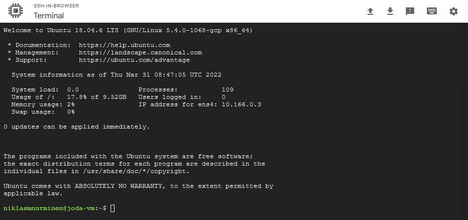

# Kehitysympäristö

_Niklas Nurminen - Johdanto datatieteeseen_

Kehitysympäristönä käytän Google Cloud Platformia. GCP:ssä pystyn luomaan virtuaalikoneen, jossa pyörii Ubuntu Linux -käyttöjärjestelmä. Tälle virtuaalikoneelle pystyy helposti asentamaan Jupyter notebookin.

GCP ympäristön aloittaminen vaatii Google-tilin. Uudet käyttäjät saavat käyttöönsä 300$. Ohjeet koko prosessiin löytyy [täältä.](https://techdirectarchive.com/2021/08/20/running-jupyter-notebook-on-google-cloud-instance/)

1. Aloitin luomalla GCP:en uuden projektin. 
 


2. Seuraavaksi loin uuden virtuaalikoneen. Valitsin E2 -sarjan koneen, jossa on 2 CPU:ta ja 4 GB RAM-muistia. Virtuaalikoneen asetuksista tulee myös hyväksyä HTTP ja HTTPS liikenne. Lisäksi valitsin käyttöjärjestelmäksi Ubuntu 18.04 version. 


3. Kolmantena vaiheena muutin dynaamisen IP-osoitteen staattiseksi. Dynaaminen IP-osoite on turvallisempi vaihtoehto, koska se muuttuu jatkuvasti, mutta tässä tapauksessa se vain aiheuttaa päänvaivaa yhdistäessä virtuaalikoneeseen.


4. Seuraavaksi tulee myös tehdä uusi palomuuri asetus, jossa sallitaan tietoliikenne tietystä IP-osoitteesta. Lisäksi tulee määritellä porttinumero. 

5. Seuraavaksi virtuaalikone on valmis käynnistettäväksi. Koneeseen voi ottaa itse SSH yhteyden, mutta helpoin on vain avata komentorivi selaimessa. 



6. Seuraavaksi tulisi asentaa Anaconda3 virtuaalikoneelle. Tätä ennen on hyvä kumminkin päivittää virtuaalikone komennolla:
```
sudo apt-get update
```
Tämän jälkeen voidaan suorittaa Anacondan asennus.
```
wget https://repo.continuum.io/archive/Anaconda3-4.2.0-Linux-x86_64.sh
bash Anaconda3-4.2.0-Linux-x86_64.sh
```

7. Tämän jälkeen luodaan Jupyteriin konfigurointi tiedosto. Tiedossa voidaan määritellä esimerkiksi porttinumero. Itse käytin nano editoria.
```
jupyter notebook --generate-config
nano ~/.jupyter/jupyter_notebook_config.py
```

8. Viimeisenä vaiheena voidaan käynnistää Jupyter notebook komennolla:
```
jupyter notebook
```
Nyt voidaan selaimella kokeilla yhdistää http://external-ip-address:port-number osoitteeseen. Jos kaikki meni oikein sinulla pitäisi pyöriä tällä hetkellä Jupyter notebook virtuaalikoneella. 

### Lähteet
1. [Ohje](https://techdirectarchive.com/2021/08/20/running-jupyter-notebook-on-google-cloud-instance/)
2. [Static vs dynamic ip](https://support.google.com/fiber/answer/3547208?hl=en)
3. [Anaconda](https://www.anaconda.com/)

### Pros & cons
1. GCP toimii hieman epävarmasti. Omasta mielestä esimerkiksi Azure on parempi ja intuitiivisempi.
2. Ohjeita löytyi runsaasti, joten tekeminen oli yksinkertaista.
3. Tietoliikenteen ymmärtäminen helpottaa käyttöönottoa.


