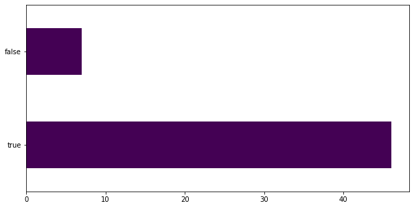

# Toimeenpano

_Niklas Nurminen - Johdanto datatieteeseen_

Viimeisessä vaiheessa testataan mallia twitteristä haettuihin uutisiin. Nämä ei välttämättä ole virallisia uutisia, koska ainoana rajana oli, että tweetistä löytyy #news.

```python
tweet_sequence = tokenize(tweet_df['clean_text'])

predict_tweet = model.predict_classes(tweet_sequence)
predict_tweet = ['true' if prediction == 1 else 'false' for prediction in predict_tweet]

tweet_prediction_df = tweet_df.copy()
tweet_prediction_df['label'] = predict_tweet

tweet_prediction_df.drop_duplicates(subset='clean_text', keep=False, inplace=True)
```

```python
tweet_prediction_df['label'].value_counts().plot(kind='barh', figsize=(10,5), colormap="viridis")
```



```python
pd.set_option('display.max_colwidth', None)
tp_false_df = tweet_prediction_df[tweet_prediction_df['label'] == 'false']
tp_false_df.head(5)
```

<table border="1" class="dataframe">   <thead>     <tr style="text-align: right;">       <th></th>       <th>text</th>       <th>clean_text</th>       <th>label</th>     </tr>   </thead>   <tbody>     <tr>       <th>16</th>       <td>Three-day Global\xa0AYUSH\xa0Investment and Innovation Summit held in Gandhinagar https://t.co/yZXvt3Arsb #news</td>       <td>three day global ayush investment innovation summit held gandhinagar</td>       <td>false</td>     </tr>     <tr>       <th>23</th>       <td>The news at 17:55:01 is News Source: Birmingham Live Title: Murder arrest over body found in Good Hope Hospital car park - Birmingham Live https://t.co/GtlcQDUu00 #news #headlines</td>       <td>news news source birmingham live title murder arrest body found good hope hospital car park birmingham live</td>       <td>false</td>     </tr>     <tr>       <th>24</th>       <td>RT @WilliamMPlante2: Keto Diet: Everything You Should Know Before You Start\ Getty Images\ The ketogenic diet is an eating plan that\'s been u…</td>       <td>rt keto diet everything know start getty image ketogenic diet eating plan u</td>       <td>false</td>     </tr>     <tr>       <th>36</th>       <td>10-year-old Algonquin girl shares the traditional skills she\'s learned on social media - CBC News has been published on Canada News Media - https://t.co/9kgAcUtXcD #news</td>       <td>year old algonquin girl share traditional skill learned social medium cbc news ha published canada news medium</td>       <td>false</td>     </tr>     <tr>       <th>37</th>       <td>Fantastic News for this vibrant city, Newcastle.\ — Local Government Surplus\ \ "Our track record of strong financial management meant that during the pandemic we were able to dip into our savings to stimulate the local economy”\ \ #Newcastle #Australian #news https://t.co/4U3ahyTqx9</td>       <td>fantastic news vibrant city newcastle local government surplus track record strong financial management meant pandemic able dip saving stimulate local economy</td>       <td>false</td>     </tr>   </tbody> </table>

* Rivi 16: Malli luokitteli uutisen valheelliseksi, joka on väärin luokiteltu. [TODISTE](https://www.deshgujarat.com/2022/04/23/global-ayush-investment-and-innovation-summit-2022-concludes-in-gandhinagar/)
* Rivi 23: Tämäkin luokiteltua näyttästi väärin. [TODISTE](https://www.bbc.com/news/uk-england-birmingham-61202248)
* Rivi 24: Tämä mielestäni luokiteltu oikein, koska kyseessä on mielipide ketoosidieetistä.
* Rivi 36: Luokiteltu väärin. [TODISTE](https://www.cbc.ca/news/indigenous/algonquin-traditional-skills-social-media-1.6427789)
* Rivi 37: Luokiteltu väärin, mutta ymmärrettävää, koska datasetti oli luotu ennen korona aikaa, joten uutisia pandemiasta oli varmasti melko vähän. [TODISTE](https://newcastle.nsw.gov.au/council/news/latest-news/end-of-covid-19-restrictions-sees-budget-return-to)


```python
tp_true_df = tweet_prediction_df[tweet_prediction_df['label'] == 'true']
tp_true_df.head(5)
```

<table border="1" class="dataframe">   <thead>     <tr style="text-align: right;">       <th></th>       <th>text</th>       <th>clean_text</th>       <th>label</th>     </tr>   </thead>   <tbody>     <tr>       <th>0</th>       <td>A Ukrainian woman who heard explosions near her apartment stepped outside to find her father\'s dead body on the sidewalk https://t.co/2vqPQP5JPs Earn money now. Work on the Internet! https://t.co/XBKDNZ447g (#Siguemeytesigo) (#Followback) (#News) (#SDV)</td>       <td>ukrainian woman heard explosion near apartment stepped outside find father dead body sidewalk earn money work internet</td>       <td>true</td>     </tr>     <tr>       <th>4</th>       <td>Maximum temperature likely to settle at nearly 40 degrees C in Delhi: IMD https://t.co/f84SO3iom7 #Business #News</td>       <td>maximum temperature likely settle nearly degree c delhi imd</td>       <td>true</td>     </tr>     <tr>       <th>5</th>       <td>Zurich turns off gas to fight climate change and Russia : NPR \ \ #russia #news\ \ https://t.co/ESxAhEz1UG</td>       <td>zurich turn gas fight climate change russia npr</td>       <td>true</td>     </tr>     <tr>       <th>6</th>       <td>RT @A_Crypto_Kay: @CryptoMichNL 100X 1000X🚨! EXCHANGE EXCHANGES ON THE WAY! CMC HAS NOT ARRIVED YET!  METAVERSE,NFT LERS ARE ON THE WAY :)…</td>       <td>rt x x exchange exchange way cmc ha arrived yet metaverse nft ler way</td>       <td>true</td>     </tr>     <tr>       <th>8</th>       <td>RT @TLund32926493: Here\'s a great example of the real Biden and the Fake Biden with a cleft in his chin, tucked ears, forhead lines don\'t m…</td>       <td>rt great example real biden fake biden cleft chin tucked ear forhead line</td>       <td>true</td>     </tr>   </tbody> </table>

* Rivi 0: Luokiteltu oikein. [TODISTE](https://www.businessinsider.com/ukrainian-woman-found-her-fathers-dead-body-outside-her-apartment-2022-4?r=US&IR=T)
* Rivi 4: Luokiteltu oikein. [TODISTE](https://www.business-standard.com/article/current-affairs/maximum-temperature-likely-to-settle-around-40-degree-c-in-delhi-imd-122042300227_1.html)
* Rivi 5: Luokiteltu oikein. [TODISTE](https://www.npr.org/2022/04/20/1092429073/to-fight-climate-change-and-now-russia-too-zurich-turns-off-natural-gas?t=1650732057132)
* Rivi 6: Tämä on mielipide uutinen, joten oikeaa tai väärää ei ole.
* Rivi 8: Luokiteltu oikein. [TODISTE](https://www.reuters.com/article/uk-factcheck-biden-face-lighting-idUSKBN26S310)

Niin aidoksi kuin feikiksi luokiteltujen uutisten analysointi oli mielenkiintoista. Oli mukava nähdä, että malli pystyy tuottamaan edes jotain järkevää. Hieman kyseenalaistan, että 75 tweetistä 7 oli väärin.