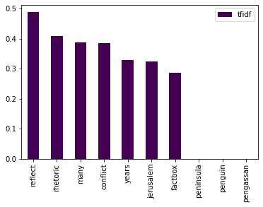
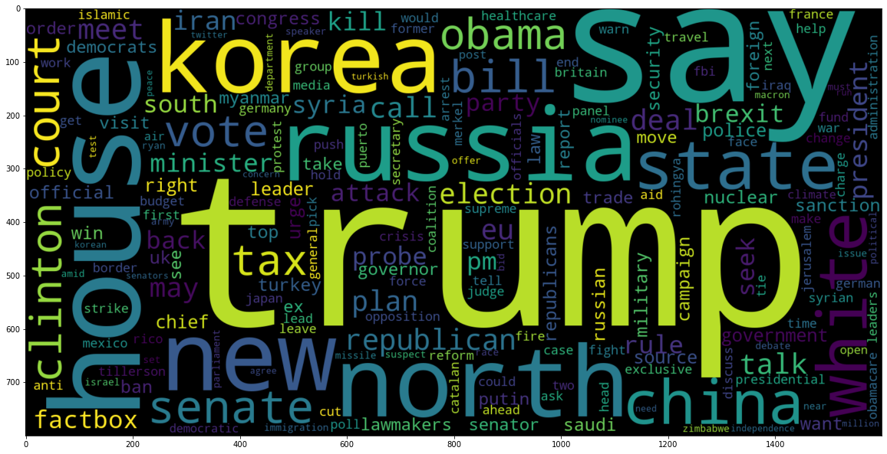
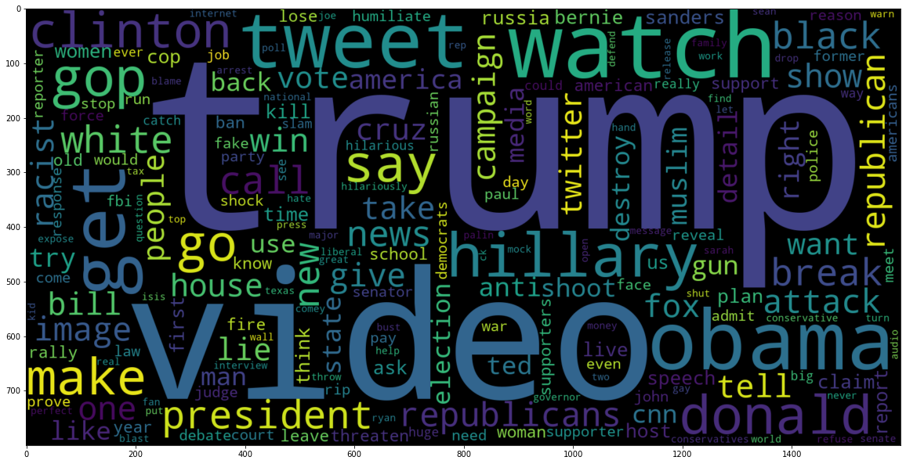
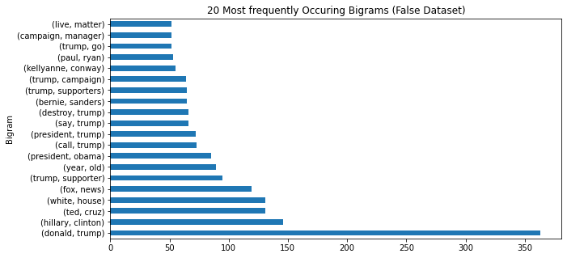

# Kaikki vaiheet kootusti

### Tekijä: Niklas Nurminen - Johdanto datatieteeseen 2022

Pistetavoitteet:
* Kehitysympäristö: 3 pistettä
* Datan kerääminen: 3 pistettä
* Datan jalostaminen: 3 pistettä
* Datan kuvaileminen: 2 pistettä
* Koneoppiminen: 2 pistettä
* Toimeenpano: 2 pistettä

# Kehitysympäristö

_Niklas Nurminen - Johdanto datatieteeseen_

Kehitysympäristönä käytän Google Cloud Platformia. GCP:ssä pystyn luomaan virtuaalikoneen, jossa pyörii Ubuntu Linux -käyttöjärjestelmä. Tälle virtuaalikoneelle pystyy helposti asentamaan Jupyter notebookin.

GCP ympäristön aloittaminen vaatii Google-tilin. Uudet käyttäjät saavat käyttöönsä 300$. Ohjeet koko prosessiin löytyy [täältä.](https://techdirectarchive.com/2021/08/20/running-jupyter-notebook-on-google-cloud-instance/)

1. Aloitin luomalla GCP:en uuden projektin. 
 


2. Seuraavaksi loin uuden virtuaalikoneen. Valitsin E2 -sarjan koneen, jossa on 2 CPU:ta ja 4 GB RAM-muistia. Virtuaalikoneen asetuksista tulee myös hyväksyä HTTP ja HTTPS liikenne. Lisäksi valitsin käyttöjärjestelmäksi Ubuntu 18.04 version. 


3. Kolmantena vaiheena muutin dynaamisen IP-osoitteen staattiseksi. Dynaaminen IP-osoite on turvallisempi vaihtoehto, koska se muuttuu jatkuvasti, mutta tässä tapauksessa se vain aiheuttaa päänvaivaa yhdistäessä virtuaalikoneeseen.


4. Seuraavaksi tulee myös tehdä uusi palomuuri asetus, jossa sallitaan tietoliikenne tietystä IP-osoitteesta. Lisäksi tulee määritellä porttinumero. 

5. Seuraavaksi virtuaalikone on valmis käynnistettäväksi. Koneeseen voi ottaa itse SSH yhteyden, mutta helpoin on vain avata komentorivi selaimessa. 


6. Seuraavaksi tulisi asentaa Anaconda3 virtuaalikoneelle. Tätä ennen on hyvä kumminkin päivittää virtuaalikone komennolla:
```
sudo apt-get update
```
Tämän jälkeen voidaan suorittaa Anacondan asennus.
```
wget https://repo.continuum.io/archive/Anaconda3-4.2.0-Linux-x86_64.sh
bash Anaconda3-4.2.0-Linux-x86_64.sh
```

7. Tämän jälkeen luodaan Jupyteriin konfigurointi tiedosto. Tiedossa voidaan määritellä esimerkiksi porttinumero. Itse käytin nano editoria.
```
jupyter notebook --generate-config
nano ~/.jupyter/jupyter_notebook_config.py
```

8. Viimeisenä vaiheena voidaan käynnistää Jupyter notebook komennolla:
```
jupyter notebook
```
Nyt voidaan selaimella kokeilla yhdistää http://external-ip-address:port-number osoitteeseen. Jos kaikki meni oikein sinulla pitäisi pyöriä tällä hetkellä Jupyter notebook virtuaalikoneella. 

### Lähteet
1. [Ohje](https://techdirectarchive.com/2021/08/20/running-jupyter-notebook-on-google-cloud-instance/)
2. [Static vs dynamic ip](https://support.google.com/fiber/answer/3547208?hl=en)
3. [Anaconda](https://www.anaconda.com/)

### Pros & cons
1. GCP toimii hieman epävarmasti. Omasta mielestä esimerkiksi Azure on parempi ja intuitiivisempi.
2. Ohjeita löytyi runsaasti, joten tekeminen oli yksinkertaista.
3. Tietoliikenteen ymmärtäminen helpottaa käyttöönottoa.

# Datan kerääminen

_Niklas Nurminen - Johdanto datatieteeseen_

Valmiin datasetin löysin Kagglesta. Dataset koostui kahdesta eri .csv tiedostosta. Toinen tiedosto oli täynnä aitoja uutisia, kun puolestaan toinen oli täysin väärennetty. Tulen jakamaan datasetin osiin: opetus- ja testidataksi. Datan setin löydät [tästä.](https://www.kaggle.com/datasets/clmentbisaillon/fake-and-real-news-dataset) Datasetin avulla pystytään opettamaan luokittelija, mikä myöhemmin pystyy arvioimaan, että onko jokin uutinen aito. HUOM. käsitellään vain englannin kielisiä uutisia.

Toinen datasetti kerättiin Twitteristä käyttämällä Pythonin Tweepy kirjastoa. Tällä datasetillä pystyn hyvin tarkastelemaan aiemmin opetetun luokittelijan toimintaa. Mielenkiintoista nähdä, kuinka suuren osan luokittelija luokittelee epäaidoksi uutiseksi. Jos intoa ja aikaa riittää niin myöhemmin voisi vielä kerätä esimerkiksi uutistoimisto BBC twitter kanavalta uutisia. Voisi ainakin kuvitella, että näistä tweettauksista suurin osa olisi aitoja.

```python
import tweepy
import pandas as pd

# Add your Bearer token here.
client = tweepy.Client(bearer_token='')

# Create Pandas dataframe with three columns
df = pd.DataFrame(columns=['text', 'language'])

# Query tweets with #news. Show only 100 tweets
query = '#news'
tweets = client.search_recent_tweets(query=query, tweet_fields=['lang'], max_results=100)

for tweet in tweets.data:
    text = tweet.text
    language = tweet.lang

    # Focus only to tweets in english
    if language == 'en':
        tmp = [text, language]
        df.loc[len(df)] = tmp

# Total amount of tweets in dataframe
print('Amount: ', len(df))

# Show first 5 lines of dataframe
df.head()
```

### Lähteet
1. [Tweepy dokumentaatio](https://docs.tweepy.org/en/stable/)
2. [Twitter developer platform](https://developer.twitter.com/en)
3. [Fake and real news dataset](https://www.kaggle.com/datasets/clmentbisaillon/fake-and-real-news-dataset)

### Pros & cons
1. Kagglesta löytyy erittäin paljon valmiita datasettejä.
2. Tweepy kirjaston käyttäminen oli melko yksinkertaista.
3. Kipeenä on vaikea keskittyä tekemiseen.


# Datan jalostaminen

_Niklas Nurminen - Johdanto datatieteeseen_

Datasetit alustettiin viime kerralla DataFrameen käyttäen Pandas kirjastoa. Ensimmäinen DataFrame sisälsi kaksi eri .csv tiedostoa, joista toinen sisälti vain "feikki" uutisia ja toinen vain aitoja. Toinen DataFrame täytettiin Twitteristä saaduilla tweettauksilla, jossa rajaehtona oli #news hashtag. 

Ensimmäisenä toimintona yhdistin Fake.csv ja True.csv tiedostot yhdeksi DataFrameksi. 

```python
truenews = pd.read_csv("../files/True.csv")
fakenews = pd.read_csv("../files/Fake.csv")

truenews['label'] = 1
fakenews['label'] = 0

news_df = pd.concat([truenews, fakenews])
news_df = news_df.sample(frac = 1).reset_index(drop=True)
news_df.head()
```


Seuraavana vaiheena tarkistettiin, että sisältääkö DataFramet NULL arvoja. Sen lisäksi tarkastettiin muuttujien tietotyypit. 

```python
print("Does Twitter Dataframe contain null values: ", tweet_df.isnull().values.any())
print("Does News Dataframe contain null values: ", news_df.isnull().values.any(), "\n")

print("Twitter dataframe datatypes: \n", tweet_df.dtypes, "\n")
print("News dataframe datatypes: \n", news_df.dtypes)
```

    Does Twitter Dataframe contain null values:  False
    Does News Dataframe contain null values:  False 

    Twitter dataframe datatypes: 
    text        object
    language    object
    dtype: object 

    News dataframe datatypes: 
    title      object
    text       object
    subject    object
    date       object
    label       int64
    dtype: object

Tulokseksi saatiin, että DataFramet eivät sisältäneet NULL arvoja. Myös muuttujien tietotyypit olivat oikeanlaiset datan käsittelyyn.

Tämän jälkeen pystyttiin siirtymään datan jalostamiseen. Aluksi määrittelin muutaman funktion kautta tekstin siivoajan. Tekstin siivoajalla pystytään karsimaan kaikki turha pois, kuten emojit ja symbolit. Lisäksi sanat myös muokattiin koneelle helpommin tulkittavaan muotoon. Esimerkiksi sana "loving" olisi vain "love". Tähän käytettiin NLTK kirjaston WordNetLemmatizer luokkaa. Lopuksi vielä testattiin toimivuus yksinkertaisella tekstillä.

```python
def deEmojify(text):
    regex_pattern = re.compile(pattern = "["
        u"\U0001F600-\U0001F64F"  # emoticons
        u"\U0001F300-\U0001F5FF"  # symbols & pictographs
        u"\U0001F680-\U0001F6FF"  # transport & map symbols
        u"\U0001F1E0-\U0001F1FF"  # flags (iOS)
                           "]+", flags = re.UNICODE)
    return regex_pattern.sub(r'', text)

def clean_text(tweet):
    # Lower case text
    tweet = tweet.lower()

    # Remove mentions
    tweet = re.sub("@[A-Za-z0-9]+","", tweet)

    # Remove links
    tweet = re.sub(r"(?:\@|http?\://|https?\://|www)\S+", "", tweet)

    # Remove hastags
    tweet = re.sub("#[A-Za-z0-9_]+","", tweet)

    # Remove punctuations
    tweet = re.sub('[()!?]', ' ', tweet)
    tweet = re.sub('\[.*?\]',' ', tweet)

    # Remove emoticons
    tweet = deEmojify(tweet)

    # Filter non-alphanumeric characters (double check...)
    tweet = re.sub("[^a-z0-9]"," ", tweet)

    # Tokenize tweet (split...)
    tokens = word_tokenize(tweet)

    # Lemmatize words
    lemmatizer = WordNetLemmatizer()
    tokens = [lemmatizer.lemmatize(word, pos='v') for word in tokens]

    # Remove stop words
    stop_words = set(stopwords.words('english'))
    tokens = [w for w in tokens if not w in stop_words]

    cleaned_tweet = ' '.join(tokens)

    return cleaned_tweet

test_text = "The @SpaceX Dragon Endeavour with four @Axiom_Space astronauts is holding 20 meters away from the station as the station crew works a video routing issue. https://nasa.gov/live"
print("Before: ", test_text)
print("After: ", clean_text(test_text))
```

    Before:  The @SpaceX Dragon Endeavour with four @Axiom_Space astronauts is holding 20 meters away from the station as the station crew works a video routing issue. https://nasa.gov/live

    After:  dragon endeavour four space astronauts hold 20 meter away station station crew work video rout issue

Seuraavaksi molempien datasettien teksteille tehtiin siivous. Siivottu teksti pätkä lisättiin tämän jälkeen DataFrameen uudelle sarakkeelle.

```python
news_df['clean_text'] = np.nan

news_df['clean_text'] = [clean_text(x) for x in news_df['title']]

news_df.dropna(subset=['clean_text'], inplace=True)
news_df.drop_duplicates(subset=['text', 'clean_text'], keep=False, inplace=True)

news_df.head()

tweet_df['clean_text'] = np.nan

tweet_df['clean_text'] = [clean_text(x) for x in tweet_df['text']]

tweet_df.dropna(subset=['clean_text'], inplace=True)
tweet_df.drop_duplicates(subset=['text', 'clean_text'], keep=False, inplace=True)

tweet_df.head()
```

Viimeisenä datan jalostamisen vaiheena jokaiselle sanalle määritettiin kokonaislukuarvo. Kokonaisluvuista muodostuu ketju/lista, jossa jokainen kokonaislukuarvo esittää jotain tiettyä sanaa. Tätä ennen kumminkin tuli tehdä uusi dataframe, joka pitää sisällään kaikki sanat DataFrameista. 

```python
clean_text_combined = pd.concat([news_df['clean_text'], tweet_df['clean_text']])
clean_text_combined.head()
print("All clean texts combined size: ", clean_text_combined.size)

tokenizer = Tokenizer()
tokenizer.fit_on_texts(clean_text_combined)

def tokenize(text):
    tmp_text = tokenizer.texts_to_sequences(text)
    tmp_text = pad_sequences(tmp_text, padding='post', maxlen=232)
    return tmp_text
```

```python
tweet_df['sequence'] = np.nan
tweet_df['sequence'] = list(tokenize(tweet_df['clean_text']))

tweet_df.head()
```


```python
news_df['sequence'] = np.nan
news_df['sequence'] = list(tokenize(news_df['clean_text']))

news_df.head()
```


Lopuksi vielä jaettiin news dataframe osiksi. 20 % test ja 80% train.

```python
train_df, test_df = train_test_split(news_df, test_size=0.2)
train_df.head()
```


### Lähteet
1. [NLTK text cleaning](https://www.analyticsvidhya.com/blog/2020/11/text-cleaning-nltk-library/)
2. [Tokenizer](https://www.tensorflow.org/api_docs/python/tf/keras/preprocessing/text/Tokenizer)
3. [Feature extraction techniques](https://www.geeksforgeeks.org/feature-extraction-techniques-nlp/)

### Pros & cons
1. Tämä on yksi tärkeämmistä ja työläisimmistä vaiheista.
2. Tekstin siivous funktion toteuttaminen oli yksinkertaista ohjeiden avulla.
3. Ajoittain Pandas kirjaston syntaksi on hankalaa.

# Datan kuvaileminen

_Niklas Nurminen - Johdanto datatieteeseen_

Viime kerralla datasetit saatiin jalostettua ja nyt päästään kuvailemaan dataa. Datan kuvailemisen avulla pystytään varmistamaan, että tekstin käsittely on onnistunut. Tämä näkyi ihan konkreettisesti tekemisessä, koska esimerkiksi huomasin, että jotkin käsitellyt lauseet silti sisälsivät turhaa tietoa NLP analysointiin. Tätä kautta pystyin korjaamaan heti ongelman pois.

## Suosituimmat sanat

Ensimmäiseksi lähdin tarkastelemaan suosituimpia sanoja dataseteissä.

```python
tokenized_counts = Counter(tokenizer.word_counts)
tokenized_df = pd.DataFrame([tokenized_counts.keys(), tokenized_counts.values()]).T
tokenized_df.columns=['word', 'quantity']
tokenized_df = tokenized_df.sort_values(by='quantity', ascending=False)
tokenized_df[:30].plot(kind="bar",x="word", orientation="vertical", figsize=(15,10), xlabel="Tokens", ylabel="Count", colormap="viridis", table=False, grid=False, fontsize=12, rot=35, position=1, title="30 most popular words in dataframes", legend=True).legend(["Tokens"], loc="lower left", prop={"size":15})
```


```python
plt.figure(figsize=(20,20))
wc = WordCloud(max_words= 200, width = 1600, height= 800).generate_from_frequencies(tokenized_counts)
plt.imshow(wc, interpolation = 'bilinear')
```


## Uutisten ja tweettauksien pituus

Seuraavaksi tutkin uutisten ja tweettauksien pituuksia. Alla olevassa kuvassa näytetään 200 pisintä.

```python
length_df = pd.DataFrame(columns=['length'])
length_df['length'] = [len(i) for i in clean_text_combined]
length_df.sort_values(by=['length'], inplace=True, ascending=False)
length_df = length_df.reset_index(drop=True)
length_df[:200].plot(title="Longest 200 tweet/news lengths", figsize=(10,5), xlabel='index', ylabel='word count')
```


## Datan jakaantuminen luotettaviin ja valheellisiin uutisiin eri dataseteissä.

Opetusdatan jakaantuminen luotettaviin ja valheellisiin uutisiin.

```python
train_df['label'].value_counts().plot(kind='barh', figsize=(10,5), colormap="viridis")
```


Testidatan jakaantuminen luotettaviin ja valheellisiin uutisiin.

```python
test_df['label'].value_counts().plot(kind='barh', figsize=(10,5), colormap="viridis")
```


## TF-IDF

Term Frequency - Inverse Document Frequency kertoo sanan yleisyyttä. Mitä korkeampi TF-IDF arvo sitä kuvaavampi sana on.

```python
cv = CountVectorizer()
word_count_vector = cv.fit_transform([x for x in clean_text_combined])
tfidf_transformer = TfidfTransformer(smooth_idf=True,use_idf=True) 
tfidf_transformer.fit(word_count_vector)

df_idf = pd.DataFrame(tfidf_transformer.idf_, index=cv.get_feature_names_out(),columns=["idf_weights"]) 
df_idf.sort_values(by=['idf_weights'])
```


```python
count_vector = cv.transform([x for x in clean_text_combined])
tf_idf_vector = tfidf_transformer.transform(count_vector)

feature_names = cv.get_feature_names_out()
first_document_vector=tf_idf_vector[0] 
tf_idf_df = pd.DataFrame(first_document_vector.T.todense(), index=feature_names, columns=["tfidf"])
tf_idf_df = tf_idf_df.sort_values(by=["tfidf"],ascending=False)
tf_idf_df[:10].plot(kind="bar", colormap="viridis")
```


## Suosituimmat sanat luotettavissa uutisissa

```python
plt.figure(figsize=(20,20))
true_df = news_df[news_df['label'] == 1]
tokenizer_true = Tokenizer()
tokenizer_true.fit_on_texts([x for x in true_df['clean_text']])
tokenized_counts_true = Counter(tokenizer_true.word_counts)
wc_true = WordCloud(max_words= 200, width = 1600, height= 800).generate_from_frequencies(tokenized_counts_true)
plt.imshow(wc_true, interpolation = 'bilinear')
```


## Suosituimmat sanat valheellisissa uutisissa

```python
plt.figure(figsize=(20,20))
false_df = news_df[news_df['label'] == 0]
tokenizer_false = Tokenizer()
tokenizer_false.fit_on_texts([x for x in false_df['clean_text']])
tokenized_counts_false = Counter(tokenizer_false.word_counts)
wc_false = WordCloud(max_words= 200, width = 1600, height= 800).generate_from_frequencies(tokenized_counts_false)
plt.imshow(wc_false, interpolation = 'bilinear')
```


## N-gram

N-gram avulla pystytään löytämään suosituimmat sanatrendit. Tämä on esimerkiksi tiedonhaun onnistumisessa tärkeä elementti. Näiden avulla voidaan rakentaa tilastollisia kielimalleja. Itse käytin vain kahden sanan kombinaatioita eli Bigram.

Luotettavien uutisten bigrammi.

```python
true_word = ''.join(true_df['clean_text'].tolist())
true_bigrams_series = pd.Series(ngrams(true_word.split(), 2))
true_bigrams_series = true_bigrams_series.value_counts()
true_bigrams_series = true_bigrams_series.sort_values(ascending=False)
true_bigrams_series[:20].plot(kind='barh', figsize=(10,5), xlabel='Bigram', ylabel='# of Occurances', title='20 Most frequently Occuring Bigrams (True Dataset)')
```


Valheellisten uutisten bigrammi.

```python
false_word = ''.join(false_df['clean_text'].tolist())
false_bigrams_series = pd.Series(ngrams(false_word.split(), 2))
false_bigrams_series = false_bigrams_series.value_counts()
false_bigrams_series = false_bigrams_series.sort_values(ascending=False)
false_bigrams_series[:20].plot(kind='barh', figsize=(10,5), xlabel='Bigram', ylabel='# of Occurances', title='20 Most frequently Occuring Bigrams (False Dataset)')
```


### Lähteet
1. [TF-IDF](https://towardsdatascience.com/text-summarization-using-tf-idf-e64a0644ace3)
2. [N-gram](https://www.analyticsvidhya.com/blog/2019/08/comprehensive-guide-language-model-nlp-python-code/)
3. [Describing the data](https://towardsdatascience.com/how-do-we-describe-data-9ce688943c8e)

### Pros & cons
1. Tämä vaihe oli erittäin työläs, sillä taulukoita piti muokkailla paljon diagrammeja varten.
2. Ohjeita löytyy runsaasti ja ne ovat todella selkeitä.
3. Iteraatioiden kautta myös harjoitustyön laatu paranee.

# Koneoppiminen

_Niklas Nurminen - Johdanto datatieteeseen_

## Mallin opettaminen (opetusdata)

Toisiksi viimeisessä vaiheessa luotiin opetusdatan avulla malli. Käytin mallin tekemiseen Keras kirjaston Sequential mallia. Tässä vaiheessa jouduin paljon itsemään tietoa eri foorumeilta, kuten Stack Overflowsta.

```python
batch_size = 256
epochs = 10
embed_size = 100

model = Sequential()

model.add(Embedding(max_features, output_dim=embed_size, input_length=maxlen, trainable=False))
model.add(LSTM(units=128 , return_sequences = True , recurrent_dropout = 0.25 , dropout = 0.25))
model.add(LSTM(units=64 , recurrent_dropout = 0.1 , dropout = 0.1))
model.add(Dense(units = 32 , activation = 'relu'))
model.add(Dense(1, activation='sigmoid'))
model.compile(optimizer=tf.keras.optimizers.Adam(learning_rate = 0.01), loss='binary_crossentropy', metrics=['accuracy'])

model.summary()
```


Jotkin mallin parametrit olivat itselle erittäin mystisiä ja niiden testaaminen oli hidasta. Koko mallin rakentaminen kesti 30 minuuttia, joten pyrin välttämään turhaa säätämistä. Tietenkin epochsin määrää voisi vähentää esimerkiksi neljään, jolloin datasetti käytäisiin vain 4 kertaa läpi.

```python
history = model.fit(X_train, y_train, validation_split=0.3, epochs=10, batch_size=batch_size, shuffle=True, verbose = 1)
```

Tässä tulos mallin opettamisen jälkeen: Epoch 10/10
* loss: 0.0407 
* accuracy: 0.9854 
* val_loss: 0.0453 
* val_accuracy: 0.9825

## Mallin testaaminen (testidata)

Kumminkaan nämä luvut eivät kerro mallin toiminnasta vielä kaikkea. Seuraavaksi testasin mallia testidataan.

```python
print("Test the accuracy of the model with Testing data:", model.evaluate(X_test, y_test))
```

Tämä antoi seuraavat tulokset: 
* loss: 0.0407 = 0.04%
* accuracy: 0.9850 = 98.5%

```python
predict = model.predict_classes(X_test)
print(classification_report(y_test, predict))
```


Precision eli tarkkuus kertoo, kuinka positiiviseksi luokitellut datapisteet oli positiivisia. Recall eli herkkyys taas kertoo siitä, kuinka hyvin malli pystyy luokittelemaan positiiviseksi kaikki oikeasti positiiviset tapaukset. [Tästä](https://en.wikipedia.org/wiki/Precision_and_recall) voi vielä lukea lisää tietoa. F1-arvo puolestaan on tarkkuden ja herkkyyden painotettu keskiarvo. Yhteenvetona voidaan sanoa, että tulokset ovat todella hyvät.

Seuraavassa vaiheessa tarkastellaan, miten malli ennustaa twitteristä saatujen uutisten aitouden. Siinä vaiheessa ei enään saada lukuja siitä, miten malli suoriutui vaan uutisia pitää myös itse tulkita ja tarkastella. Tämä johtuu siitä, että ei ole mitään vertailuarvoa uutisen aitoudelle.

### Lähteet
1. [Sequential malli](https://keras.io/guides/sequential_model/)
2. [Classification report](https://scikit-learn.org/stable/modules/generated/sklearn.metrics.classification_report.html)
3. [NLP mallin rakentaminen](https://blog.dominodatalab.com/deep-learning-illustrated-building-natural-language-processing-models)

### Pros & cons
1. Aiempia osuuksia, kuten datan siivousta piti korjailla melko paljon.
2. Tekeminen on hidasta ja mallit sisältävät paljon vaikeasti ymmärrettäviä parametrejä.
3. Tehokkaampi virtuaalikone säästäisi huomattavan paljon aikaa.

# Toimeenpano

_Niklas Nurminen - Johdanto datatieteeseen_

Viimeisessä vaiheessa testataan mallia twitteristä haettuihin uutisiin. Nämä ei välttämättä ole virallisia uutisia, koska ainoana rajana oli, että tweetistä löytyy #news.

```python
tweet_sequence = tokenize(tweet_df['clean_text'])

predict_tweet = model.predict_classes(tweet_sequence)
predict_tweet = ['true' if prediction == 1 else 'false' for prediction in predict_tweet]

tweet_prediction_df = tweet_df.copy()
tweet_prediction_df['label'] = predict_tweet

tweet_prediction_df.drop_duplicates(subset='clean_text', keep=False, inplace=True)
```

```python
tweet_prediction_df['label'].value_counts().plot(kind='barh', figsize=(10,5), colormap="viridis")
```


```python
pd.set_option('display.max_colwidth', None)
tp_false_df = tweet_prediction_df[tweet_prediction_df['label'] == 'false']
tp_false_df.head(5)
```

<table border="1" class="dataframe">   <thead>     <tr style="text-align: right;">       <th></th>       <th>text</th>       <th>clean_text</th>       <th>label</th>     </tr>   </thead>   <tbody>     <tr>       <th>16</th>       <td>Three-day Global\xa0AYUSH\xa0Investment and Innovation Summit held in Gandhinagar https://t.co/yZXvt3Arsb #news</td>       <td>three day global ayush investment innovation summit held gandhinagar</td>       <td>false</td>     </tr>     <tr>       <th>23</th>       <td>The news at 17:55:01 is News Source: Birmingham Live Title: Murder arrest over body found in Good Hope Hospital car park - Birmingham Live https://t.co/GtlcQDUu00 #news #headlines</td>       <td>news news source birmingham live title murder arrest body found good hope hospital car park birmingham live</td>       <td>false</td>     </tr>     <tr>       <th>24</th>       <td>RT @WilliamMPlante2: Keto Diet: Everything You Should Know Before You Start\ Getty Images\ The ketogenic diet is an eating plan that\'s been u…</td>       <td>rt keto diet everything know start getty image ketogenic diet eating plan u</td>       <td>false</td>     </tr>     <tr>       <th>36</th>       <td>10-year-old Algonquin girl shares the traditional skills she\'s learned on social media - CBC News has been published on Canada News Media - https://t.co/9kgAcUtXcD #news</td>       <td>year old algonquin girl share traditional skill learned social medium cbc news ha published canada news medium</td>       <td>false</td>     </tr>     <tr>       <th>37</th>       <td>Fantastic News for this vibrant city, Newcastle.\ — Local Government Surplus\ \ "Our track record of strong financial management meant that during the pandemic we were able to dip into our savings to stimulate the local economy”\ \ #Newcastle #Australian #news https://t.co/4U3ahyTqx9</td>       <td>fantastic news vibrant city newcastle local government surplus track record strong financial management meant pandemic able dip saving stimulate local economy</td>       <td>false</td>     </tr>   </tbody> </table>

* Rivi 16: Malli luokitteli uutisen valheelliseksi, joka on väärin luokiteltu. [TODISTE](https://www.deshgujarat.com/2022/04/23/global-ayush-investment-and-innovation-summit-2022-concludes-in-gandhinagar/)
* Rivi 23: Tämäkin luokiteltua näyttästi väärin. [TODISTE](https://www.bbc.com/news/uk-england-birmingham-61202248)
* Rivi 24: Tämä mielestäni luokiteltu oikein, koska kyseessä on mielipide ketoosidieetistä.
* Rivi 36: Luokiteltu väärin. [TODISTE](https://www.cbc.ca/news/indigenous/algonquin-traditional-skills-social-media-1.6427789)
* Rivi 37: Luokiteltu väärin, mutta ymmärrettävää, koska datasetti oli luotu ennen korona aikaa, joten uutisia pandemiasta oli varmasti melko vähän. [TODISTE](https://newcastle.nsw.gov.au/council/news/latest-news/end-of-covid-19-restrictions-sees-budget-return-to)


```python
tp_true_df = tweet_prediction_df[tweet_prediction_df['label'] == 'true']
tp_true_df.head(5)
```

<table border="1" class="dataframe">   <thead>     <tr style="text-align: right;">       <th></th>       <th>text</th>       <th>clean_text</th>       <th>label</th>     </tr>   </thead>   <tbody>     <tr>       <th>0</th>       <td>A Ukrainian woman who heard explosions near her apartment stepped outside to find her father\'s dead body on the sidewalk https://t.co/2vqPQP5JPs Earn money now. Work on the Internet! https://t.co/XBKDNZ447g (#Siguemeytesigo) (#Followback) (#News) (#SDV)</td>       <td>ukrainian woman heard explosion near apartment stepped outside find father dead body sidewalk earn money work internet</td>       <td>true</td>     </tr>     <tr>       <th>4</th>       <td>Maximum temperature likely to settle at nearly 40 degrees C in Delhi: IMD https://t.co/f84SO3iom7 #Business #News</td>       <td>maximum temperature likely settle nearly degree c delhi imd</td>       <td>true</td>     </tr>     <tr>       <th>5</th>       <td>Zurich turns off gas to fight climate change and Russia : NPR \ \ #russia #news\ \ https://t.co/ESxAhEz1UG</td>       <td>zurich turn gas fight climate change russia npr</td>       <td>true</td>     </tr>     <tr>       <th>6</th>       <td>RT @A_Crypto_Kay: @CryptoMichNL 100X 1000X🚨! EXCHANGE EXCHANGES ON THE WAY! CMC HAS NOT ARRIVED YET!  METAVERSE,NFT LERS ARE ON THE WAY :)…</td>       <td>rt x x exchange exchange way cmc ha arrived yet metaverse nft ler way</td>       <td>true</td>     </tr>     <tr>       <th>8</th>       <td>RT @TLund32926493: Here\'s a great example of the real Biden and the Fake Biden with a cleft in his chin, tucked ears, forhead lines don\'t m…</td>       <td>rt great example real biden fake biden cleft chin tucked ear forhead line</td>       <td>true</td>     </tr>   </tbody> </table>

* Rivi 0: Luokiteltu oikein. [TODISTE](https://www.businessinsider.com/ukrainian-woman-found-her-fathers-dead-body-outside-her-apartment-2022-4?r=US&IR=T)
* Rivi 4: Luokiteltu oikein. [TODISTE](https://www.business-standard.com/article/current-affairs/maximum-temperature-likely-to-settle-around-40-degree-c-in-delhi-imd-122042300227_1.html)
* Rivi 5: Luokiteltu oikein. [TODISTE](https://www.npr.org/2022/04/20/1092429073/to-fight-climate-change-and-now-russia-too-zurich-turns-off-natural-gas?t=1650732057132)
* Rivi 6: Tämä on mielipide uutinen, joten oikeaa tai väärää ei ole.
* Rivi 8: Luokiteltu oikein. [TODISTE](https://www.reuters.com/article/uk-factcheck-biden-face-lighting-idUSKBN26S310)

Niin aidoksi kuin feikiksi luokiteltujen uutisten analysointi oli mielenkiintoista. Oli mukava nähdä, että malli pystyy tuottamaan edes jotain järkevää. Hieman kyseenalaistan, että 75 tweetistä 7 oli väärin.

Mielenkiinnosta halusin vielä testata malli toista datasettiä vasten. Datasetin linkki löytyy [tästä.](https://www.kaggle.com/datasets/hassanamin/textdb3?select=fake_or_real_news.csv) 

```python
extra_df = pd.read_csv("../files/fake_or_real_news.csv")
extra_df['text'] = extra_df['title'] + " " + extra_df['text']

del extra_df['title']
del extra_df['Unnamed: 0']

extra_df['clean_text'] = [clean_text(x) for x in extra_df['text']]

extra_sequence = tokenize(extra_df['clean_text'])

predict_extra = model.predict_classes(extra_sequence)
predict_extra = ['true' if prediction == 1 else 'false' for prediction in predict_extra]

extra_df['prediction'] = predict_extra
```

<table border="1" class="dataframe">   <thead>     <tr style="text-align: right;">       <th></th>       <th>text</th>       <th>label</th>       <th>clean_text</th>       <th>prediction</th>     </tr>   </thead>   <tbody>     <tr>       <th>0</th>       <td>You Can Smell Hillary’s Fear Daniel Greenfield, a Shillman Journalism Fellow at the Freedom Center, is a New York writer focusing on radical Islam. \ In the final stretch of the election, Hillary Rodham Clinton has gone to war with the FBI. \ The word “unprecedented” has been thrown around so often this election that it ought to be retired. But it’s still unprecedented for the nominee of a major political party to go war with the FBI. \ But that’s exactly what Hillary and her people have done. Coma patients just waking up now and watching an hour of CNN from their hospital beds would assume that FBI Director James Comey is Hillary’s opponent in this election. \ The FBI is under attack by everyone from Obama to CNN. Hillary’s people have circulated a letter attacking Comey. There are currently more media hit pieces lambasting him than targeting Trump. It wouldn’t be too surprising if the Clintons or their allies were to start running attack ads against the FBI. \ The FBI’s leadership is being warned that the entire left-wing establishment will form a lynch mob if they continue going after Hillary. And the FBI’s credibility is being attacked by the media and the Democrats to preemptively head off the results of the investigation of the Clinton Foundation and Hillary Clinton. \ The covert struggle between FBI agents and Obama’s DOJ people has gone explosively public. \ The New York Times has compared Comey to J. Edgar Hoover. Its bizarre headline, “James Comey Role Recalls Hoover’s FBI, Fairly or Not” practically admits up front that it’s spouting nonsense. The Boston Globe has published a column calling for Comey’s resignation. Not to be outdone, Time has an editorial claiming that the scandal is really an attack on all women. \ James Carville appeared on MSNBC to remind everyone that he was still alive and insane. He accused Comey of coordinating with House Republicans and the KGB. And you thought the “vast right wing conspiracy” was a stretch. \ Countless media stories charge Comey with violating procedure. Do you know what’s a procedural violation? Emailing classified information stored on your bathroom server. \ Senator Harry Reid has sent Comey a letter accusing him of violating the Hatch Act. The Hatch Act is a nice idea that has as much relevance in the age of Obama as the Tenth Amendment. But the cable news spectrum quickly filled with media hacks glancing at the Wikipedia article on the Hatch Act under the table while accusing the FBI director of one of the most awkward conspiracies against Hillary ever. \ If James Comey is really out to hurt Hillary, he picked one hell of a strange way to do it. \ Not too long ago Democrats were breathing a sigh of relief when he gave Hillary Clinton a pass in a prominent public statement. If he really were out to elect Trump by keeping the email scandal going, why did he trash the investigation? Was he on the payroll of House Republicans and the KGB back then and playing it coy or was it a sudden development where Vladimir Putin and Paul Ryan talked him into taking a look at Anthony Weiner’s computer? \ Either Comey is the most cunning FBI director that ever lived or he’s just awkwardly trying to navigate a political mess that has trapped him between a DOJ leadership whose political futures are tied to Hillary’s victory and his own bureau whose apolitical agents just want to be allowed to do their jobs. \ The only truly mysterious thing is why Hillary and her associates decided to go to war with a respected Federal agency. Most Americans like the FBI while Hillary Clinton enjoys a 60% unfavorable rating. \ And it’s an interesting question. \ Hillary’s old strategy was to lie and deny that the FBI even had a criminal investigation underway. Instead her associates insisted that it was a security review. The FBI corrected her and she shrugged it off. But the old breezy denial approach has given way to a savage assault on the FBI. \ Pretending that nothing was wrong was a bad strategy, but it was a better one that picking a fight with the FBI while lunatic Clinton associates try to claim that the FBI is really the KGB. \ There are two possible explanations. \ Hillary Clinton might be arrogant enough to lash out at the FBI now that she believes that victory is near. The same kind of hubris that led her to plan her victory fireworks display could lead her to declare a war on the FBI for irritating her during the final miles of her campaign. \ But the other explanation is that her people panicked. \ Going to war with the FBI is not the behavior of a smart and focused presidential campaign. It’s an act of desperation. When a presidential candidate decides that her only option is to try and destroy the credibility of the FBI, that’s not hubris, it’s fear of what the FBI might be about to reveal about her. \ During the original FBI investigation, Hillary Clinton was confident that she could ride it out. And she had good reason for believing that. But that Hillary Clinton is gone. In her place is a paranoid wreck. Within a short space of time the “positive” Clinton campaign promising to unite the country has been replaced by a desperate and flailing operation that has focused all its energy on fighting the FBI. \ There’s only one reason for such bizarre behavior. \ The Clinton campaign has decided that an FBI investigation of the latest batch of emails poses a threat to its survival. And so it’s gone all in on fighting the FBI. It’s an unprecedented step born of fear. It’s hard to know whether that fear is justified. But the existence of that fear already tells us a whole lot. \ Clinton loyalists rigged the old investigation. They knew the outcome ahead of time as well as they knew the debate questions. Now suddenly they are no longer in control. And they are afraid. \ You can smell the fear. \ The FBI has wiretaps from the investigation of the Clinton Foundation. It’s finding new emails all the time. And Clintonworld panicked. The spinmeisters of Clintonworld have claimed that the email scandal is just so much smoke without fire. All that’s here is the appearance of impropriety without any of the substance. But this isn’t how you react to smoke. It’s how you respond to a fire. \ The misguided assault on the FBI tells us that Hillary Clinton and her allies are afraid of a revelation bigger than the fundamental illegality of her email setup. The email setup was a preemptive cover up. The Clinton campaign has panicked badly out of the belief, right or wrong, that whatever crime the illegal setup was meant to cover up is at risk of being exposed. \ The Clintons have weathered countless scandals over the years. Whatever they are protecting this time around is bigger than the usual corruption, bribery, sexual assaults and abuses of power that have followed them around throughout the years. This is bigger and more damaging than any of the allegations that have already come out. And they don’t want FBI investigators anywhere near it. \ The campaign against Comey is pure intimidation. It’s also a warning. Any senior FBI people who value their careers are being warned to stay away. The Democrats are closing ranks around their nominee against the FBI. It’s an ugly and unprecedented scene. It may also be their last stand. \ Hillary Clinton has awkwardly wound her way through numerous scandals in just this election cycle. But she’s never shown fear or desperation before. Now that has changed. Whatever she is afraid of, it lies buried in her emails with Huma Abedin. And it can bring her down like nothing else has.</td>       <td>FAKE</td>       <td>smell hillary fear daniel greenfield shillman journalism fellow freedom center new york writer focusing radical islam final stretch election hillary rodham clinton ha gone war fbi word unprecedented ha thrown around often election ought retired still unprecedented nominee major political party go war fbi exactly hillary people done coma patient waking watching hour cnn hospital bed would assume fbi director james comey hillary opponent election fbi attack everyone obama cnn hillary people circulated letter attacking comey currently medium hit piece lambasting targeting trump surprising clinton ally start running attack ad fbi fbi leadership warned entire left wing establishment form lynch mob continue going hillary fbi credibility attacked medium democrat preemptively head result investigation clinton foundation hillary clinton covert struggle fbi agent obama doj people ha gone explosively public new york time ha compared comey j edgar hoover bizarre headline james comey role recall hoover fbi fairly practically admits front spouting nonsense boston globe ha published column calling comey resignation outdone time ha editorial claiming scandal really attack woman james carville appeared msnbc remind everyone wa still alive insane accused comey coordinating house republican kgb thought vast right wing conspiracy wa stretch countless medium story charge comey violating procedure know procedural violation emailing classified information stored bathroom server senator harry reid ha sent comey letter accusing violating hatch act hatch act nice idea ha much relevance age obama tenth amendment cable news spectrum quickly filled medium hack glancing wikipedia article hatch act table accusing fbi director one awkward conspiracy hillary ever james comey really hurt hillary picked one hell strange way long ago democrat breathing sigh relief gave hillary clinton pas prominent public statement really elect trump keeping email scandal going trash investigation wa payroll house republican kgb back playing coy wa sudden development vladimir putin paul ryan talked taking look anthony weiner computer either comey cunning fbi director ever lived awkwardly trying navigate political mess ha trapped doj leadership whose political future tied hillary victory bureau whose apolitical agent want allowed job truly mysterious thing hillary associate decided go war respected federal agency american like fbi hillary clinton enjoys unfavorable rating interesting question hillary old strategy wa lie deny fbi even criminal investigation underway instead associate insisted wa security review fbi corrected shrugged old breezy denial approach ha given way savage assault fbi pretending nothing wa wrong wa bad strategy wa better one picking fight fbi lunatic clinton associate try claim fbi really kgb two possible explanation hillary clinton might arrogant enough lash fbi belief victory near kind hubris led plan victory firework display could lead declare war fbi irritating final mile campaign explanation people panicked going war fbi behavior smart focused presidential campaign act desperation presidential candidate decides option try destroy credibility fbi hubris fear fbi might reveal original fbi investigation hillary clinton wa confident could ride good reason believing hillary clinton gone place paranoid wreck within short space time positive clinton campaign promising unite country ha replaced desperate flailing operation ha focused energy fighting fbi one reason bizarre behavior clinton campaign ha decided fbi investigation latest batch email pose threat survival gone fighting fbi unprecedented step born fear hard know whether fear justified existence fear already tell u whole lot clinton loyalist rigged old investigation knew outcome ahead time well knew debate question suddenly longer control afraid smell fear fbi ha wiretap investigation clinton foundation finding new email time clintonworld panicked spinmeister clintonworld claimed email scandal much smoke without fire appearance impropriety without substance react smoke respond fire misguided assault fbi tell u hillary clinton ally afraid revelation bigger fundamental illegality email setup email setup wa preemptive cover clinton campaign ha panicked badly belief right wrong whatever crime illegal setup wa meant cover risk exposed clinton weathered countless scandal year whatever protecting time around bigger usual corruption bribery sexual assault abuse power followed around throughout year bigger damaging allegation already come want fbi investigator anywhere near campaign comey pure intimidation also warning senior fbi people value career warned stay away democrat closing rank around nominee fbi ugly unprecedented scene may also last stand hillary clinton ha awkwardly wound way numerous scandal election cycle never shown fear desperation ha changed whatever afraid lie buried email huma abedin bring like nothing else ha</td>       <td>true</td>     </tr>     <tr>       <th>1</th>       <td>Watch The Exact Moment Paul Ryan Committed Political Suicide At A Trump Rally (VIDEO) Google Pinterest Digg Linkedin Reddit Stumbleupon Print Delicious Pocket Tumblr \ There are two fundamental truths in this world: Paul Ryan desperately wants to be president. And Paul Ryan will never be president. Today proved it. \ In a particularly staggering example of political cowardice, Paul Ryan re-re-re-reversed course and announced that he was back on the Trump Train after all. This was an aboutface from where he was a few weeks ago. He had previously declared he would not be supporting or defending Trump after a tape was made public in which Trump bragged about assaulting women. Suddenly, Ryan was appearing at a pro-Trump rally and boldly declaring that he already sent in his vote to make him President of the United States. It was a surreal moment. The figurehead of the Republican Party dosed himself in gasoline, got up on a stage on a chilly afternoon in Wisconsin, and lit a match. . @SpeakerRyan says he voted for @realDonaldTrump : “Republicans, it is time to come home” https://t.co/VyTT49YvoE pic.twitter.com/wCvSCg4a5I \ — ABC News Politics (@ABCPolitics) November 5, 2016 \ The Democratic Party couldn’t have asked for a better moment of film. Ryan’s chances of ever becoming president went down to zero in an instant. In the wreckage Trump is to leave behind in his wake, those who cravenly backed his campaign will not recover. If Ryan’s career manages to limp all the way to 2020, then the DNC will have this tape locked and loaded to be used in every ad until Election Day. \ The ringing endorsement of the man he clearly hates on a personal level speaks volumes about his own spinelessness. Ryan has postured himself as a “principled” conservative, and one uncomfortable with Trump’s unapologetic bigotry and sexism. However, when push came to shove, Paul Ryan – like many of his colleagues – turned into a sniveling appeaser. After all his lofty tak about conviction, his principles were a house of cards and collapsed with the slightest breeze. \ What’s especially bizarre is how close Ryan came to making it through unscathed. For months the Speaker of the House refused to comment on Trump at all. His strategy seemed to be to keep his head down, pretend Trump didn’t exist, and hope that nobody remembered what happened in 2016. Now, just days away from the election, he screwed it all up. \ If 2016’s very ugly election has done any good it’s by exposing the utter cowardice of the Republicans who once feigned moral courage. A reality television star spit on them, hijacked their party, insulted their wives, and got every last one of them to kneel before him. What a turn of events. \ Featured image via Twitter</td>       <td>FAKE</td>       <td>watch exact moment paul ryan committed political suicide trump rally video google pinterest digg linkedin reddit stumbleupon print delicious pocket tumblr two fundamental truth world paul ryan desperately want president paul ryan never president today proved particularly staggering example political cowardice paul ryan reversed course announced wa back trump train wa aboutface wa week ago previously declared would supporting defending trump tape wa made public trump bragged assaulting woman suddenly ryan wa appearing pro trump rally boldly declaring already sent vote make president united state wa surreal moment figurehead republican party dosed gasoline got stage chilly afternoon wisconsin lit match say voted republican time come home pic twitter com wcvscg abc news politics november democratic party asked better moment film ryan chance ever becoming president went zero instant wreckage trump leave behind wake cravenly backed campaign recover ryan career manages limp way dnc tape locked loaded used every ad election day ringing endorsement man clearly hate personal level speaks volume spinelessness ryan ha postured principled conservative one uncomfortable trump unapologetic bigotry sexism however push came shove paul ryan like many colleague turned sniveling appeaser lofty tak conviction principle house card collapsed slightest breeze especially bizarre close ryan came making unscathed month speaker house refused comment trump strategy seemed keep head pretend trump exist hope nobody remembered happened day away election screwed ugly election ha done good exposing utter cowardice republican feigned moral courage reality television star spit hijacked party insulted wife got every last one kneel turn event featured image via twitter</td>       <td>false</td>     </tr>     <tr>       <th>2</th>       <td>Kerry to go to Paris in gesture of sympathy U.S. Secretary of State John F. Kerry said Monday that he will stop in Paris later this week, amid criticism that no top American officials attended Sunday’s unity march against terrorism.\ \ Kerry said he expects to arrive in Paris Thursday evening, as he heads home after a week abroad. He said he will fly to France at the conclusion of a series of meetings scheduled for Thursday in Sofia, Bulgaria. He plans to meet the next day with Foreign Minister Laurent Fabius and President Francois Hollande, then return to Washington.\ \ The visit by Kerry, who has family and childhood ties to the country and speaks fluent French, could address some of the criticism that the United States snubbed France in its darkest hour in many years.\ \ The French press on Monday was filled with questions about why neither President Obama nor Kerry attended Sunday’s march, as about 40 leaders of other nations did. Obama was said to have stayed away because his own security needs can be taxing on a country, and Kerry had prior commitments.\ \ Among roughly 40 leaders who did attend was Israeli Prime Minister Benjamin Netanyahu, no stranger to intense security, who marched beside Hollande through the city streets. The highest ranking U.S. officials attending the march were Jane Hartley, the ambassador to France, and Victoria Nuland, the assistant secretary of state for European affairs. Attorney General Eric H. Holder Jr. was in Paris for meetings with law enforcement officials but did not participate in the march.\ \ Kerry spent Sunday at a business summit hosted by India’s prime minister, Narendra Modi. The United States is eager for India to relax stringent laws that function as barriers to foreign investment and hopes Modi’s government will act to open the huge Indian market for more American businesses.\ \ In a news conference, Kerry brushed aside criticism that the United States had not sent a more senior official to Paris as “quibbling a little bit.” He noted that many staffers of the American Embassy in Paris attended the march, including the ambassador. He said he had wanted to be present at the march himself but could not because of his prior commitments in India.\ \ “But that is why I am going there on the way home, to make it crystal clear how passionately we feel about the events that have taken place there,” he said.\ \ “And I don’t think the people of France have any doubts about America’s understanding of what happened, of our personal sense of loss and our deep commitment to the people of France in this moment of trauma.”</td>       <td>REAL</td>       <td>kerry go paris gesture sympathy u secretary state john f kerry said monday stop paris later week amid criticism top american official attended sunday unity march terrorism kerry said expects arrive paris thursday evening head home week abroad said fly france conclusion series meeting scheduled thursday sofia bulgaria plan meet next day foreign minister laurent fabius president francois hollande return washington visit kerry ha family childhood tie country speaks fluent french could address criticism united state snubbed france darkest hour many year french press monday wa filled question neither president obama kerry attended sunday march leader nation obama wa said stayed away security need taxing country kerry prior commitment among roughly leader attend wa israeli prime minister benjamin netanyahu stranger intense security marched beside hollande city street highest ranking u official attending march jane hartley ambassador france victoria nuland assistant secretary state european affair attorney general eric h holder jr wa paris meeting law enforcement official participate march kerry spent sunday business summit hosted india prime minister narendra modi united state eager india relax stringent law function barrier foreign investment hope modi government act open huge indian market american business news conference kerry brushed aside criticism united state sent senior official paris quibbling little bit noted many staffer american embassy paris attended march including ambassador said wanted present march could prior commitment india going way home make crystal clear passionately feel event taken place said think people france doubt america understanding happened personal sense loss deep commitment people france moment trauma</td>       <td>true</td>     </tr>     <tr>       <th>3</th>       <td>Bernie supporters on Twitter erupt in anger against the DNC: \'We tried to warn you!\' — Kaydee King (@KaydeeKing) November 9, 2016 The lesson from tonight\'s Dem losses: Time for Democrats to start listening to the voters. Stop running the same establishment candidates. \ — People For Bernie (@People4Bernie) November 9, 2016 If Dems didn\'t want a tight race they shouldn\'t have worked against Bernie. \ — Walker Bragman (@WalkerBragman) November 9, 2016 \ New York Times columnist Paul Krugman, who was one of Hillary Clinton’s most outspoken surrogates during the contentious Democratic primary, blamed Clinton’s poor performance on Green Party candidate Jill Stein, who has so far received a negligible number of votes nationally, saying Stein was the Ralph Nader of 2016 in preventing a Clinton victory. The account @BerniesTeachers threw Krugman’s analysis back in his face. Your candidate was the issue. Take responsibility. https://t.co/KHyOuUSrFS \ — Teachers for Bernie (@BerniesTeachers) November 9, 2016 \ Ana Navarro, a Republican who recently endorsed Hillary Clinton, summed up the preposterous nature of the 2016 presidential election in this tweet: GOP nominated the only damn candidate who could lose to Hillary Clinton. Democrats nominated the only damn candidate who could lose to Trump \ — Ana Navarro (@ananavarro) November 9, 2016 \ Popular left-wing Facebook page The Other 98%, which was pro-Sanders during the primary, responded to Trump’s surge by simply posting a meme of Sanders’ face with the text “All this could’ve been avoided. Thanks for nothing, DNC!” The meme has been shared almost 15,000 times in less than an hour: \ Posted by The Other 98% on Tuesday, November 8, 2016 \ While Bernie Sanders endorsed Hillary Clinton just before the Democratic National Convention in July, many of his supporters remained adamant in their refusal to support the DNC-anointed candidate, pointing to WikiLeaks’ revelations that top officials at the DNC had been working behind the scenes to tip the scales in Clinton’s favor by coordinating with media figures to circulate anti-Sanders narratives. \ Rather than attribute a potential Trump presidency to the GOP nominee’s perceived popularity among voters, the closeness of this election could be credited to Hillary Clinton’s unfavorable ratings. According to RealClearPolitics, anywhere between 51 and 57 percent of voters had a negative opinion of the Democratic nominee. \ As of 11 PM Eastern, Florida, Michigan, Pennsylvania, and Wisconsin remain too close to call. Clinton has 197 electoral votes to Trump’s 187. \ \ Zach Cartwright is an activist and author from Richmond, Virginia. He enjoys writing about politics, government, and the media. Send him an email at [email protected]</td>       <td>FAKE</td>       <td>bernie supporter twitter erupt anger dnc tried warn kaydee king november lesson tonight dem loss time democrat start listening voter stop running establishment candidate people bernie november dems want tight race worked bernie walker bragman november new york time columnist paul krugman wa one hillary clinton outspoken surrogate contentious democratic primary blamed clinton poor performance green party candidate jill stein ha far received negligible number vote nationally saying stein wa ralph nader preventing clinton victory account threw krugman analysis back face candidate wa issue take responsibility teacher bernie november ana navarro republican recently endorsed hillary clinton summed preposterous nature presidential election tweet gop nominated damn candidate could lose hillary clinton democrat nominated damn candidate could lose trump ana navarro november popular left wing facebook page wa pro sander primary responded trump surge simply posting meme sander face text could avoided thanks nothing dnc meme ha shared almost time le hour posted tuesday november bernie sander endorsed hillary clinton democratic national convention july many supporter remained adamant refusal support dnc anointed candidate pointing wikileaks revelation top official dnc working behind scene tip scale clinton favor coordinating medium figure circulate anti sander narrative rather attribute potential trump presidency gop nominee perceived popularity among voter closeness election could credited hillary clinton unfavorable rating according realclearpolitics anywhere percent voter negative opinion democratic nominee pm eastern florida michigan pennsylvania wisconsin remain close call clinton ha electoral vote trump zach cartwright activist author richmond virginia enjoys writing politics government medium send email</td>       <td>true</td>     </tr>     <tr>       <th>4</th>       <td>The Battle of New York: Why This Primary Matters It\'s primary day in New York and front-runners Hillary Clinton and Donald Trump are leading in the polls.\ \ Trump is now vowing to win enough delegates to clinch the Republican nomination and prevent a contested convention. But Sens.Ted Cruz, R-Texas, Bernie Sanders, D-Vt., and Ohio Gov. John Kasich and aren\'t giving up just yet.\ \ A big win in New York could tip the scales for both the Republican and Democratic front-runners in this year\'s race for the White House. Clinton and Trump have each suffered losses in recent contests, shifting the momentum to their rivals.\ \ "We have won eight out of the last nine caucuses and primaries! Cheer!" Sanders recently told supporters.\ \ While wins in New York for Trump and Clinton are expected, the margins of those victories are also important.\ \ Trump needs to capture more than 50 percent of the vote statewide if he wants to be positioned to win all of the state\'s 95 GOP delegates. That would put him one step closer to avoiding a contested convention.\ \ "We\'ve got to vote and you know Cruz is way, way down in the polls," Trump urged supporters.\ \ Meanwhile, Sanders is hoping for a close race in the Empire State. A loss by 10 points means he\'ll need to win 80 percent of the remaining delegates to clinch the nomination.\ \ Despite a predicted loss in New York, Cruz hasn\'t lost momentum. He\'s hoping to sweep up more delegates this weekend while he\'s talking about how he can win in November.\ \ "Because if I\'m the nominee, we win the General Election," Cruz promised his supporters. "We\'re beating Hillary in the key swing states, we\'re beating Hillary with Independents, we\'re beating Hillary with young people."\ \ For now, Cruz, Kasich, and Sanders have all moved on from New York to other states. Trump and Clinton are the only two staying in their home state to watch the results come in.</td>       <td>REAL</td>       <td>battle new york primary matter primary day new york front runner hillary clinton donald trump leading poll trump vowing win enough delegate clinch republican nomination prevent contested convention sen ted cruz r texas bernie sander vt ohio gov john kasich giving yet big win new york could tip scale republican democratic front runner year race white house clinton trump suffered loss recent contest shifting momentum rival eight last nine caucus primary cheer sander recently told supporter win new york trump clinton expected margin victory also important trump need capture percent vote statewide want positioned win state gop delegate would put one step closer avoiding contested convention got vote know cruz way way poll trump urged supporter meanwhile sander hoping close race empire state loss point mean need win percent remaining delegate clinch nomination despite predicted loss new york cruz lost momentum hoping sweep delegate weekend talking win november nominee win general election cruz promised supporter beating hillary key swing state beating hillary independent beating hillary young people cruz kasich sander moved new york state trump clinton two staying home state watch result come</td>       <td>true</td>     </tr>   </tbody> </table>

```python
classification_right = 0
classification_wrong = 0
for index, row in extra_df.iterrows():
    if row['label'] == 'REAL' and row['prediction'] == 'true':
        classification_right += 1
    else:
        classification_wrong += 1

print("Model predicted correctly:", classification_right)
print("Model predicted wrongly:", classification_wrong)
```

* Model predicted correctly: 2679
* Model predicted wrongly: 3656

Uuden datasetin testaaminen ei tuottanut haluttua lopputulosta, koska malli ennusti yli puolet väärin. Kuitenkin voin olla tyytyväinen harjoitustyön lopputulokseen, koska koko prosessi oli hyvin opettavaista. Omasta mielestä parannettavaa on esimerkiksi datan siivouksen puolella sekä mallin luomisessa. Lisäksi mallille voisi antaa huomattavasti enemmän dataa, joka mahdollistaisi paremman luokittelun.

Tämän kaltaista NLP-mallia voisi käyttää monessa eri tilanteessa, esimerkiksi juuri Twitterissä. Hyvin koulutettu malli pystyisi rajoittamaan väärän tiedon levittämisen yhteiskunnassa. Näitä onkin käytössä huomattavan paljon ja ne ovat melko pinnalla nykyisen sotatilanteen takia. 

### Lähteet
1. [New dataset](https://www.kaggle.com/datasets/hassanamin/textdb3?select=fake_or_real_news.csv)

### Pros & cons
1. Tulosten analysointi on hankalaa, koska mikään ei välttämättä kerro onko uutinen feikki vai ei.
2. Mallin käyttäminen itsessään on melko yksinkertaista.
3. Vaikea löytyy syy ennustuksien huonouteen.