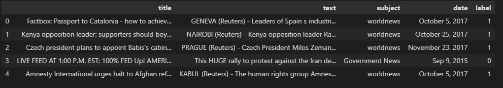
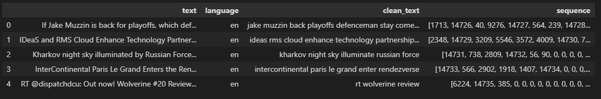
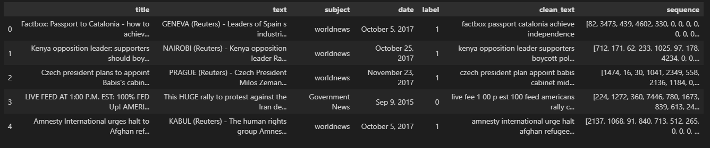
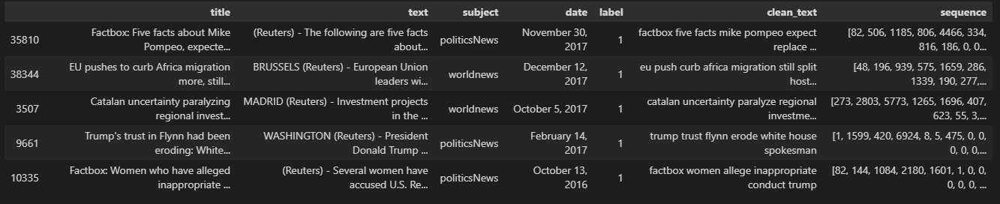

# Datan jalostaminen

_Niklas Nurminen - Johdanto datatieteeseen_

Datasetit alustettiin viime kerralla DataFrameen käyttäen Pandas kirjastoa. Ensimmäinen DataFrame sisälsi kaksi eri .csv tiedostoa, joista toinen sisälti vain "feikki" uutisia ja toinen vain aitoja. Toinen DataFrame täytettiin Twitteristä saaduilla tweettauksilla, jossa rajaehtona oli #news hashtag. 

Ensimmäisenä toimintona yhdistin Fake.csv ja True.csv tiedostot yhdeksi DataFrameksi. 

```python
truenews = pd.read_csv("../files/True.csv")
fakenews = pd.read_csv("../files/Fake.csv")

truenews['label'] = 1
fakenews['label'] = 0

news_df = pd.concat([truenews, fakenews])
news_df = news_df.sample(frac = 1).reset_index(drop=True)
news_df.head()
```


Seuraavana vaiheena tarkistettiin, että sisältääkö DataFramet NULL arvoja. Sen lisäksi tarkastettiin muuttujien tietotyypit. 

```python
print("Does Twitter Dataframe contain null values: ", tweet_df.isnull().values.any())
print("Does News Dataframe contain null values: ", news_df.isnull().values.any(), "\n")

print("Twitter dataframe datatypes: \n", tweet_df.dtypes, "\n")
print("News dataframe datatypes: \n", news_df.dtypes)
```

    Does Twitter Dataframe contain null values:  False
    Does News Dataframe contain null values:  False 

    Twitter dataframe datatypes: 
    text        object
    language    object
    dtype: object 

    News dataframe datatypes: 
    title      object
    text       object
    subject    object
    date       object
    label       int64
    dtype: object

Tulokseksi saatiin, että DataFramet eivät sisältäneet NULL arvoja. Myös muuttujien tietotyypit olivat oikeanlaiset datan käsittelyyn.

Tämän jälkeen pystyttiin siirtymään datan jalostamiseen. Aluksi määrittelin muutaman funktion kautta tekstin siivoajan. Tekstin siivoajalla pystytään karsimaan kaikki turha pois, kuten emojit ja symbolit. Lisäksi sanat myös muokattiin koneelle helpommin tulkittavaan muotoon. Esimerkiksi sana "loving" olisi vain "love". Tähän käytettiin NLTK kirjaston WordNetLemmatizer luokkaa. Lopuksi vielä testattiin toimivuus yksinkertaisella tekstillä.

```python
def deEmojify(text):
    regex_pattern = re.compile(pattern = "["
        u"\U0001F600-\U0001F64F"  # emoticons
        u"\U0001F300-\U0001F5FF"  # symbols & pictographs
        u"\U0001F680-\U0001F6FF"  # transport & map symbols
        u"\U0001F1E0-\U0001F1FF"  # flags (iOS)
                           "]+", flags = re.UNICODE)
    return regex_pattern.sub(r'', text)

def clean_text(tweet):
    # Lower case text
    tweet = tweet.lower()

    # Remove mentions
    tweet = re.sub("@[A-Za-z0-9]+","", tweet)

    # Remove links
    tweet = re.sub(r"(?:\@|http?\://|https?\://|www)\S+", "", tweet)

    # Remove hastags
    tweet = re.sub("#[A-Za-z0-9_]+","", tweet)

    # Remove punctuations
    tweet = re.sub('[()!?]', ' ', tweet)
    tweet = re.sub('\[.*?\]',' ', tweet)

    # Remove emoticons
    tweet = deEmojify(tweet)

    # Filter non-alphanumeric characters (double check...)
    tweet = re.sub("[^a-z0-9]"," ", tweet)

    # Tokenize tweet (split...)
    tokens = word_tokenize(tweet)

    # Lemmatize words
    lemmatizer = WordNetLemmatizer()
    tokens = [lemmatizer.lemmatize(word, pos='v') for word in tokens]

    # Remove stop words
    stop_words = set(stopwords.words('english'))
    tokens = [w for w in tokens if not w in stop_words]

    cleaned_tweet = ' '.join(tokens)

    return cleaned_tweet

test_text = "The @SpaceX Dragon Endeavour with four @Axiom_Space astronauts is holding 20 meters away from the station as the station crew works a video routing issue. https://nasa.gov/live"
print("Before: ", test_text)
print("After: ", clean_text(test_text))
```

    Before:  The @SpaceX Dragon Endeavour with four @Axiom_Space astronauts is holding 20 meters away from the station as the station crew works a video routing issue. https://nasa.gov/live

    After:  dragon endeavour four space astronauts hold 20 meter away station station crew work video rout issue

Seuraavaksi molempien datasettien teksteille tehtiin siivous. Siivottu teksti pätkä lisättiin tämän jälkeen DataFrameen uudelle sarakkeelle.

```python
news_df['clean_text'] = np.nan

news_df['clean_text'] = [clean_text(x) for x in news_df['title']]

news_df.dropna(subset=['clean_text'], inplace=True)
news_df.drop_duplicates(subset=['text', 'clean_text'], keep=False, inplace=True)

news_df.head()

tweet_df['clean_text'] = np.nan

tweet_df['clean_text'] = [clean_text(x) for x in tweet_df['text']]

tweet_df.dropna(subset=['clean_text'], inplace=True)
tweet_df.drop_duplicates(subset=['text', 'clean_text'], keep=False, inplace=True)

tweet_df.head()
```

Viimeisenä datan jalostamisen vaiheena jokaiselle sanalle määritettiin kokonaislukuarvo. Kokonaisluvuista muodostuu ketju/lista, jossa jokainen kokonaislukuarvo esittää jotain tiettyä sanaa. Tätä ennen kumminkin tuli tehdä uusi dataframe, joka pitää sisällään kaikki sanat DataFrameista. 

```python
clean_text_combined = pd.concat([news_df['clean_text'], tweet_df['clean_text']])
clean_text_combined.head()
print("All clean texts combined size: ", clean_text_combined.size)

tokenizer = Tokenizer()
tokenizer.fit_on_texts(clean_text_combined)

def tokenize(text):
    tmp_text = tokenizer.texts_to_sequences(text)
    tmp_text = pad_sequences(tmp_text, padding='post', maxlen=232)
    return tmp_text
```

```python
tweet_df['sequence'] = np.nan
tweet_df['sequence'] = list(tokenize(tweet_df['clean_text']))

tweet_df.head()
```


```python
news_df['sequence'] = np.nan
news_df['sequence'] = list(tokenize(news_df['clean_text']))

news_df.head()
```


Lopuksi vielä jaettiin news dataframe osiksi. 20 % test ja 80% train.

```python
train_df, test_df = train_test_split(news_df, test_size=0.2)
train_df.head()
```


### Lähteet
1. [NLTK text cleaning](https://www.analyticsvidhya.com/blog/2020/11/text-cleaning-nltk-library/)
2. [Tokenizer](https://www.tensorflow.org/api_docs/python/tf/keras/preprocessing/text/Tokenizer)
3. [Feature extraction techniques](https://www.geeksforgeeks.org/feature-extraction-techniques-nlp/)

### Pros & cons
1. Tämä on yksi tärkeämmistä ja työläisimmistä vaiheista.
2. Tekstin siivous funktion toteuttaminen oli yksinkertaista ohjeiden avulla.
3. Ajoittain Pandas kirjaston syntaksi on hankalaa.


