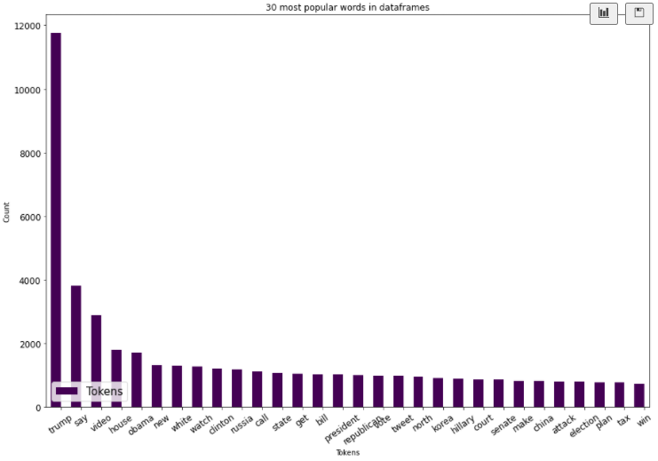
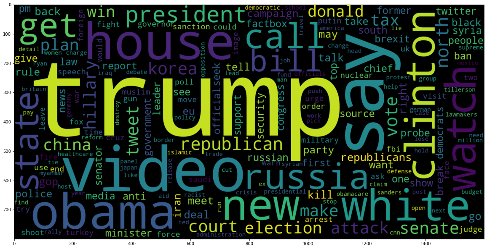
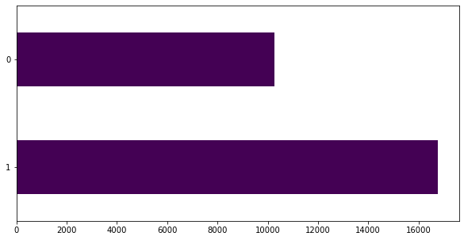
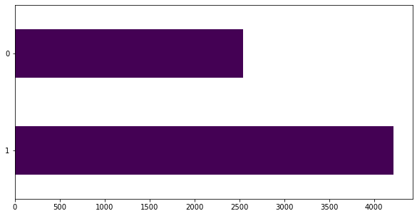
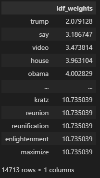
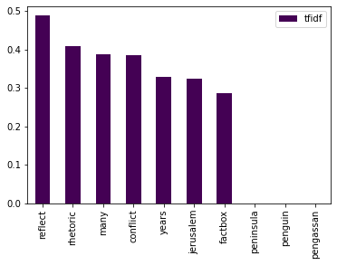
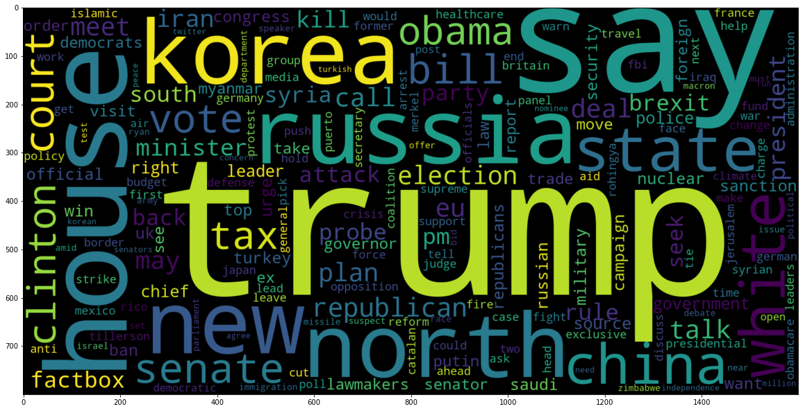
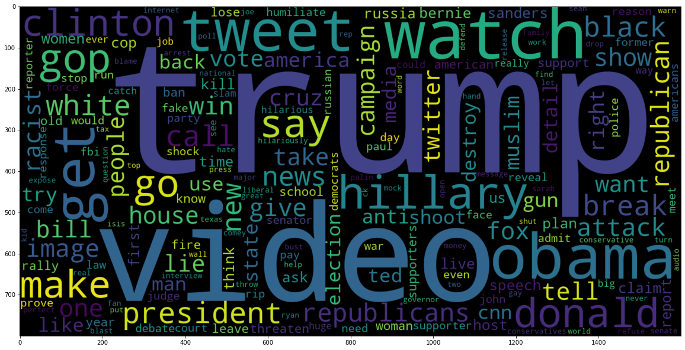
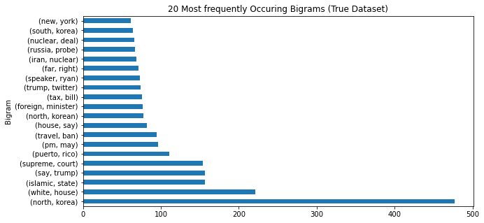
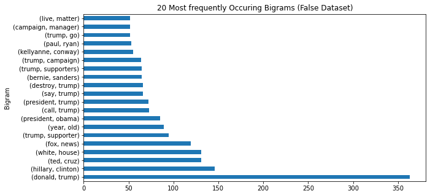

# Datan kuvaileminen

_Niklas Nurminen - Johdanto datatieteeseen_

Viime kerralla datasetit saatiin jalostettua ja nyt päästään kuvailemaan dataa. Datan kuvailemisen avulla pystytään varmistamaan, että tekstin käsittely on onnistunut. Tämä näkyi ihan konkreettisesti tekemisessä, koska esimerkiksi huomasin, että jotkin käsitellyt lauseet silti sisälsivät turhaa tietoa NLP analysointiin. Tätä kautta pystyin korjaamaan heti ongelman pois.

## Suosituimmat sanat

Ensimmäiseksi lähdin tarkastelemaan suosituimpia sanoja dataseteissä.

```python
tokenized_counts = Counter(tokenizer.word_counts)
tokenized_df = pd.DataFrame([tokenized_counts.keys(), tokenized_counts.values()]).T
tokenized_df.columns=['word', 'quantity']
tokenized_df = tokenized_df.sort_values(by='quantity', ascending=False)
tokenized_df[:30].plot(kind="bar",x="word", orientation="vertical", figsize=(15,10), xlabel="Tokens", ylabel="Count", colormap="viridis", table=False, grid=False, fontsize=12, rot=35, position=1, title="30 most popular words in dataframes", legend=True).legend(["Tokens"], loc="lower left", prop={"size":15})
```


```python
plt.figure(figsize=(20,20))
wc = WordCloud(max_words= 200, width = 1600, height= 800).generate_from_frequencies(tokenized_counts)
plt.imshow(wc, interpolation = 'bilinear')
```


## Uutisten ja tweettauksien pituus

Seuraavaksi tutkin uutisten ja tweettauksien pituuksia. Alla olevassa kuvassa näytetään 200 pisintä.

```python
length_df = pd.DataFrame(columns=['length'])
length_df['length'] = [len(i) for i in clean_text_combined]
length_df.sort_values(by=['length'], inplace=True, ascending=False)
length_df = length_df.reset_index(drop=True)
length_df[:200].plot(title="Longest 200 tweet/news lengths", figsize=(10,5), xlabel='index', ylabel='word count')
```


## Datan jakaantuminen luotettaviin ja valheellisiin uutisiin eri dataseteissä.

Opetusdatan jakaantuminen luotettaviin ja valheellisiin uutisiin.

```python
train_df['label'].value_counts().plot(kind='barh', figsize=(10,5), colormap="viridis")
```



Testidatan jakaantuminen luotettaviin ja valheellisiin uutisiin.

```python
test_df['label'].value_counts().plot(kind='barh', figsize=(10,5), colormap="viridis")
```



## TF-IDF

Term Frequency - Inverse Document Frequency kertoo sanan yleisyyttä. Mitä korkeampi TF-IDF arvo sitä kuvaavampi sana on.

```python
cv = CountVectorizer()
word_count_vector = cv.fit_transform([x for x in clean_text_combined])
tfidf_transformer = TfidfTransformer(smooth_idf=True,use_idf=True) 
tfidf_transformer.fit(word_count_vector)

df_idf = pd.DataFrame(tfidf_transformer.idf_, index=cv.get_feature_names_out(),columns=["idf_weights"]) 
df_idf.sort_values(by=['idf_weights'])
```


```python
count_vector = cv.transform([x for x in clean_text_combined])
tf_idf_vector = tfidf_transformer.transform(count_vector)

feature_names = cv.get_feature_names_out()
first_document_vector=tf_idf_vector[0] 
tf_idf_df = pd.DataFrame(first_document_vector.T.todense(), index=feature_names, columns=["tfidf"])
tf_idf_df = tf_idf_df.sort_values(by=["tfidf"],ascending=False)
tf_idf_df[:10].plot(kind="bar", colormap="viridis")
```


## Suosituimmat sanat luotettavissa uutisissa

```python
plt.figure(figsize=(20,20))
true_df = news_df[news_df['label'] == 1]
tokenizer_true = Tokenizer()
tokenizer_true.fit_on_texts([x for x in true_df['clean_text']])
tokenized_counts_true = Counter(tokenizer_true.word_counts)
wc_true = WordCloud(max_words= 200, width = 1600, height= 800).generate_from_frequencies(tokenized_counts_true)
plt.imshow(wc_true, interpolation = 'bilinear')
```


## Suosituimmat sanat valheellisissa uutisissa

```python
plt.figure(figsize=(20,20))
false_df = news_df[news_df['label'] == 0]
tokenizer_false = Tokenizer()
tokenizer_false.fit_on_texts([x for x in false_df['clean_text']])
tokenized_counts_false = Counter(tokenizer_false.word_counts)
wc_false = WordCloud(max_words= 200, width = 1600, height= 800).generate_from_frequencies(tokenized_counts_false)
plt.imshow(wc_false, interpolation = 'bilinear')
```


## N-gram

N-gram avulla pystytään löytämään suosituimmat sanatrendit. Tämä on esimerkiksi tiedonhaun onnistumisessa tärkeä elementti. Näiden avulla voidaan rakentaa tilastollisia kielimalleja. Itse käytin vain kahden sanan kombinaatioita eli Bigram.

Luotettavien uutisten bigrammi.

```python
true_word = ''.join(true_df['clean_text'].tolist())
true_bigrams_series = pd.Series(ngrams(true_word.split(), 2))
true_bigrams_series = true_bigrams_series.value_counts()
true_bigrams_series = true_bigrams_series.sort_values(ascending=False)
true_bigrams_series[:20].plot(kind='barh', figsize=(10,5), xlabel='Bigram', ylabel='# of Occurances', title='20 Most frequently Occuring Bigrams (True Dataset)')
```


Valheellisten uutisten bigrammi.

```python
false_word = ''.join(false_df['clean_text'].tolist())
false_bigrams_series = pd.Series(ngrams(false_word.split(), 2))
false_bigrams_series = false_bigrams_series.value_counts()
false_bigrams_series = false_bigrams_series.sort_values(ascending=False)
false_bigrams_series[:20].plot(kind='barh', figsize=(10,5), xlabel='Bigram', ylabel='# of Occurances', title='20 Most frequently Occuring Bigrams (False Dataset)')
```


### Lähteet
1. [TF-IDF](https://towardsdatascience.com/text-summarization-using-tf-idf-e64a0644ace3)
2. [N-gram](https://www.analyticsvidhya.com/blog/2019/08/comprehensive-guide-language-model-nlp-python-code/)
3. [Describing the data](https://towardsdatascience.com/how-do-we-describe-data-9ce688943c8e)

### Pros & cons
1. Tämä vaihe oli erittäin työläs, sillä taulukoita piti muokkailla paljon diagrammeja varten.
2. Ohjeita löytyy runsaasti ja ne ovat todella selkeitä.
3. Iteraatioiden kautta myös harjoitustyön laatu paranee.
