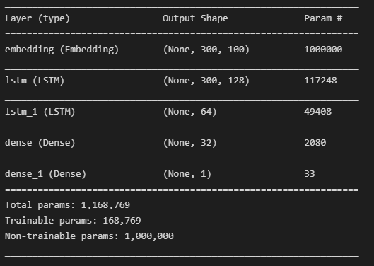
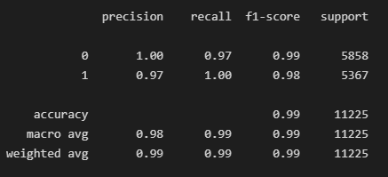

# Koneoppiminen

_Niklas Nurminen - Johdanto datatieteeseen_

## Mallin opettaminen (opetusdata)

Toisiksi viimeisessä vaiheessa luotiin opetusdatan avulla malli. Käytin mallin tekemiseen Keras kirjaston Sequential mallia. Tässä vaiheessa jouduin paljon itsemään tietoa eri foorumeilta, kuten Stack Overflowsta.

```python
batch_size = 256
epochs = 10
embed_size = 100

model = Sequential()

model.add(Embedding(max_features, output_dim=embed_size, input_length=maxlen, trainable=False))
model.add(LSTM(units=128 , return_sequences = True , recurrent_dropout = 0.25 , dropout = 0.25))
model.add(LSTM(units=64 , recurrent_dropout = 0.1 , dropout = 0.1))
model.add(Dense(units = 32 , activation = 'relu'))
model.add(Dense(1, activation='sigmoid'))
model.compile(optimizer=tf.keras.optimizers.Adam(learning_rate = 0.01), loss='binary_crossentropy', metrics=['accuracy'])

model.summary()
```



Jotkin mallin parametrit olivat itselle erittäin mystisiä ja niiden testaaminen oli hidasta. Koko mallin rakentaminen kesti 30 minuuttia, joten pyrin välttämään turhaa säätämistä. Tietenkin epochsin määrää voisi vähentää esimerkiksi neljään, jolloin datasetti käytäisiin vain 4 kertaa läpi.

```python
history = model.fit(X_train, y_train, validation_split=0.3, epochs=10, batch_size=batch_size, shuffle=True, verbose = 1)
```

Tässä tulos mallin opettamisen jälkeen: Epoch 10/10
* loss: 0.0407 
* accuracy: 0.9854 
* val_loss: 0.0453 
* val_accuracy: 0.9825

## Mallin testaaminen (testidata)

Kumminkaan nämä luvut eivät kerro mallin toiminnasta vielä kaikkea. Seuraavaksi testasin mallia testidataan.

```python
print("Test the accuracy of the model with Testing data:", model.evaluate(X_test, y_test))
```

Tämä antoi seuraavat tulokset: 
* loss: 0.0407 = 0.04%
* accuracy: 0.9850 = 98.5%

```python
predict = model.predict_classes(X_test)
print(classification_report(y_test, predict))
```



Precision eli tarkkuus kertoo, kuinka positiiviseksi luokitellut datapisteet oli positiivisia. Recall eli herkkyys taas kertoo siitä, kuinka hyvin malli pystyy luokittelemaan positiiviseksi kaikki oikeasti positiiviset tapaukset. [Tästä](https://en.wikipedia.org/wiki/Precision_and_recall) voi vielä lukea lisää tietoa. F1-arvo puolestaan on tarkkuden ja herkkyyden painotettu keskiarvo. Yhteenvetona voidaan sanoa, että tulokset ovat todella hyvät.

Seuraavassa vaiheessa tarkastellaan, miten malli ennustaa twitteristä saatujen uutisten aitouden. Siinä vaiheessa ei enään saada lukuja siitä, miten malli suoriutui vaan uutisia pitää myös itse tulkita ja tarkastella. Tämä johtuu siitä, että ei ole mitään vertailuarvoa uutisen aitoudelle.

### Lähteet
1. [Sequential malli](https://keras.io/guides/sequential_model/)
2. [Classification report](https://scikit-learn.org/stable/modules/generated/sklearn.metrics.classification_report.html)
3. [NLP mallin rakentaminen](https://blog.dominodatalab.com/deep-learning-illustrated-building-natural-language-processing-models)

### Pros & cons
1. Aiempia osuuksia, kuten datan siivousta piti korjailla melko paljon.
2. Tekeminen on hidasta ja mallit sisältävät paljon vaikeasti ymmärrettäviä parametrejä.
3. Tehokkaampi virtuaalikone säästäisi huomattavan paljon aikaa.